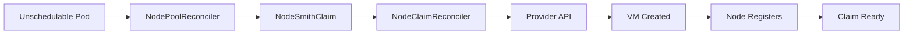
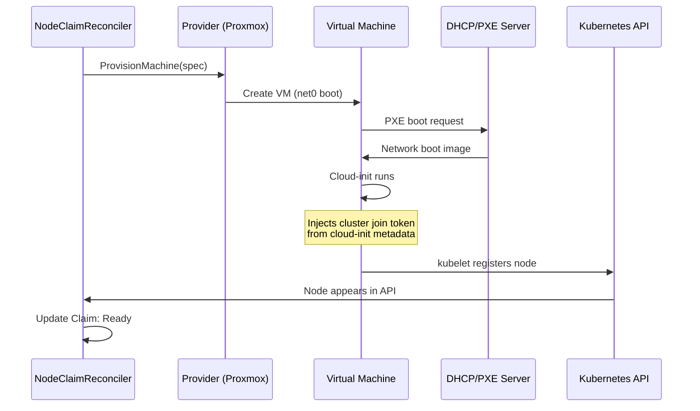

# KubeNodeSmith

KubeNodeSmith is a Kubernetes autoscaler built with Kubebuilder. It watches for unschedulable pods, provisions new worker nodes from infrastructure providers (Proxmox, Redfish, etc.), and deprovisions them when idle. Built on controller-runtime, it provides declarative node lifecycle management through custom resources.

> 🛠️ **Active development.** Architecture follows industry patterns similar to Karpenter's NodeClaim model.

---

## Architecture

KubeNodeSmith uses four custom resources to manage autoscaling:

- **NodeSmithControlPlane** – Top-level controller config that references which pools to manage
- **NodeSmithPool** – Defines node pools with min/max limits, machine templates, and scale policies
- **NodeSmithProvider** – Infrastructure provider configuration (Proxmox credentials, VM settings, etc.)
- **NodeSmithClaim** – Individual node requests with lifecycle tracking (Launched → Registered → Initialized → Ready)

Three controllers reconcile these resources:

- `ControlPlaneReconciler` – Manages provider initialization and pool coordination
- `NodePoolReconciler` – Handles scale-up/down decisions based on unschedulable pods and pool limits
- `NodeClaimReconciler` – Provisions machines, waits for node registration, and handles cleanup

### Controller Flow



**Scale-up lifecycle:**
1. Unschedulable pod detected → NodePoolReconciler creates NodeSmithClaim
2. NodeClaimReconciler provisions VM via provider
3. VM boots via DHCP netboot, cloud-init injects cluster credentials
4. Node registers with cluster → Claim status: Launched → Registered → Ready

**Scale-down lifecycle:**
1. Node becomes idle → NodePoolReconciler deletes Claim
2. NodeClaimReconciler cordons, drains, and deprovisions VM

### Node Provisioning Flow

When a NodeSmithClaim is created, the following happens:



**Key requirements for nodes:**
- **DHCP/PXE server** provides network boot capability
- **Cloud-init metadata** contains cluster bootstrap credentials (join token, CA cert)
- **Base image** must auto-register with the cluster using the configured node name prefix
- Provider configures VMs to boot from network interface (e.g., `boot=order=net0`)

## What's in the repo?

- `cmd/main.go` – Kubebuilder-generated entrypoint that starts the controller manager
- `api/v1alpha1/` – CRD type definitions for the four resource kinds
- `internal/controller/` – Controller reconciliation logic for ControlPlane, NodePool, and NodeClaim
- `internal/kube/` – Kubernetes API helpers (listing pods, nodes, resource calculations)
- `internal/provider/` – Provider interface + Proxmox implementation
- `config/` – Kubebuilder-managed kustomize configs, RBAC, CRD manifests
- `manifests/` – Deployment YAML, sample resources, and test workloads

---

## Prerequisites

- **Kubernetes cluster** (1.25+) with cluster-admin access for CRD installation
- **Infrastructure provider:**
  - **Proxmox:** API token with VM creation/deletion rights; cluster resource inspection
    - Kubernetes secret with `PROXMOX_TOKEN_ID` and `PROXMOX_SECRET` keys
  - **Other providers:** See `internal/provider/` for interface implementation
- **Base image:** Netboot-capable image that automatically joins the cluster on boot
  - Must register with kubelet using the expected node name format
  - Example: NixOS with embedded cluster bootstrap configuration

---

## Running it locally

Using Nix? Drop into the dev shell and run the controller manager locally:

```bash
nix develop
make install  # Install CRDs to your cluster
make run      # Run controller manager locally
```

The controller manager will:
- Read kubeconfig from `~/.kube/config` (or use in-cluster config when deployed)
- Start three reconciliation controllers (ControlPlane, NodePool, NodeClaim)
- Watch for changes to NodeSmith resources and unschedulable pods
- Use leader election when running multiple replicas (disabled by default for local dev)

**Configure your resources:**
Edit `config/samples/` to match your infrastructure, then apply:
```bash
kubectl create namespace kubenodesmith
kubectl create secret generic proxmox-api-secret \
  --namespace kubenodesmith \
  --from-literal=PROXMOX_TOKEN_ID='user@pam!tokenid' \
  --from-literal=PROXMOX_SECRET='your-secret-here'
kubectl apply -k config/samples/
```

Optional flags for `make run` or `go run ./cmd/main.go`:
- `--health-probe-bind-address=:8081` – Health/readiness probes (default)
- `--leader-elect` – Enable leader election for HA deployments

---

## Deploying to Kubernetes

1. **Create namespace and load credentials:**
   ```bash
   kubectl create namespace kubenodesmith
   kubectl create secret generic proxmox-api-secret \
     --namespace kubenodesmith \
     --from-literal=PROXMOX_TOKEN_ID='user@pam!tokenid' \
     --from-literal=PROXMOX_SECRET='your-secret-here'
   ```

2. **Install CRDs:**
   ```bash
   make install
   ```

3. **Configure resources for your environment:**
   Edit the sample files in `config/samples/` to match your infrastructure, then apply:
   ```bash
   kubectl apply -k config/samples/
   ```

4. **Deploy the controller manager:**
   ```bash
   make docker-build docker-push IMG=<your-registry>/kubenodesmith:tag
   make deploy IMG=<your-registry>/kubenodesmith:tag
   ```

5. **Verify deployment:**
   ```bash
   kubectl get pods -n kubenodesmith-system
   kubectl logs -n kubenodesmith-system -l control-plane=controller-manager -f
   ```

   Health checks: `http://<pod>:8081/healthz` and `http://<pod>:8081/readyz`

---

## Configuration cheat sheet

KubeNodeSmith uses CRDs under `kubenodesmith.parawell.cloud/v1alpha1`. See `config/samples/` for complete examples:

### NodeSmithProvider
Defines infrastructure provider settings (Proxmox, Redfish, etc.):

```yaml
apiVersion: kubenodesmith.parawell.cloud/v1alpha1
kind: NodeSmithProvider
metadata:
  name: proxmox-production
  namespace: kubenodesmith
spec:
  type: proxmox
  credentialsSecretRef:
    name: proxmox-api-secret
    namespace: kubenodesmith
  proxmox:
    endpoint: https://10.0.4.30:8006/api2/json
    nodeWhitelist: [alfaromeo, porsche]
    vmIDRange: { lower: 1250, upper: 1300 }
    managedNodeTag: kubenodesmith-managed
    vmMemOverheadMiB: 2048
    networkInterfaces:
      - { name: net0, model: virtio, bridge: vmbr0, vlanTag: 20, macPrefix: "02:00:00" }
    vmOptions:
      - { name: cpu, value: host }
      - { name: boot, value: order=net0 }
      # ... see config/samples/kubenodesmith_v1alpha1_nodesmithprovider.yaml for full list
```

### NodeSmithPool
Defines a node pool with capacity limits and scaling policies:

```yaml
apiVersion: kubenodesmith.parawell.cloud/v1alpha1
kind: NodeSmithPool
metadata:
  name: proxmox-small
  namespace: kubenodesmith
spec:
  providerRef: proxmox-production
  limits:
    minNodes: 0
    maxNodes: 5
    cpuCores: 0        # 0 = unlimited
    memoryMiB: 30720   # aggregate memory ceiling
  machineTemplate:
    labels:
      node-role.kubernetes.io/worker: ""
  scaleUp:
    stabilizationWindow: 2m
  scaleDown:
    stabilizationWindow: 5m
```

### NodeSmithControlPlane
Top-level controller that manages pools:

```yaml
apiVersion: kubenodesmith.parawell.cloud/v1alpha1
kind: NodeSmithControlPlane
metadata:
  name: kubenodesmith
  namespace: kubenodesmith
spec:
  pools: [proxmox-small]  # List of NodeSmithPool names to manage
```

### NodeSmithClaim (created automatically)
Represents an individual node request with lifecycle status:

```yaml
apiVersion: kubenodesmith.parawell.cloud/v1alpha1
kind: NodeSmithClaim
metadata:
  name: proxmox-small-abc123
  namespace: kubenodesmith
spec:
  poolRef: proxmox-small
  requirements:
    cpuCores: 4
    memoryMiB: 8192
status:
  conditions:
    - type: Launched
      status: "True"
    - type: Registered
      status: "True"
    - type: Ready
      status: "True"
  providerID: proxmox://cluster/vms/1251
  nodeName: zagato-worker-auto-1
```

**Key notes:**
- All resources typically live in the same namespace
- The ControlPlane controller watches pods cluster-wide for unschedulable conditions
- NodeClaims are automatically created by the NodePool controller and cleaned up when nodes are removed
- Pool labels are added automatically: `topology.kubenodesmith.io/pool: <pool-name>`

---

## What happens during a loop?

1. **Poll:** list pending pods with the “Unschedulable” condition.
2. **Scale up:** if there’s at least one, figure out the pod’s resource requests, check the pool limits, and ask the provider for a VM big enough to host it.
3. **Wait:** watch Kubernetes until the node registers (timeout 5 min), then add any configured labels.
4. **Scale down:** when there are no unschedulable pods, look for idle nodes in the pool (no evictable pods). Cordons them, calls the provider to delete the VM, and repeats.

All Kubernetes interactions live in `internal/kube.go`; provider calls go through the `internal/provider` interface so additional backends can plug in later.

---

## Kicking the tires

- Deploy one of the sample workloads:
  ```bash
  kubectl apply -f config/samples/test-workloads/echoserver.yaml
  ```
- Watch the scaler logs for a new node request and make sure the pod lands on it.
- Delete the workload and confirm the node is eventually cordoned and removed.

---

## Contributing

This project follows standard Kubebuilder patterns. When opening a PR:
- Describe your testing approach
- Note any infrastructure assumptions
- Update CRD documentation if adding fields
- Run `make test` and `make manifests` before committing

See `config/` for generated manifests and RBAC rules.

---

## License

Released under the [MIT License](LICENSE).
